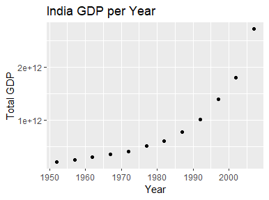
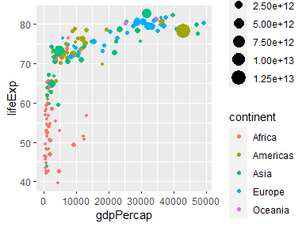

## *Gapminder EDA with Tidyverse*
##### Exploratory Data Analysis on the Gapminder Dataset with the Tidyverse
R |EDA, Exploratory Data Analysis

#### Load gapminder and dplyr.
```
library(gapminder)
library(dplyr)
```
#### Print the gapminder.

```
gapminder
```

```
gapminder
# A tibble: 1,704 x 6
   country     continent  year lifeExp      pop gdpPercap
   <fct>       <fct>     <int>   <dbl>    <int>     <dbl>
 1 Afghanistan Asia       1952    28.8  8425333      779.
 2 Afghanistan Asia       1957    30.3  9240934      821.
 3 Afghanistan Asia       1962    32.0 10267083      853.
 4 Afghanistan Asia       1967    34.0 11537966      836.
 5 Afghanistan Asia       1972    36.1 13079460      740.
 6 Afghanistan Asia       1977    38.4 14880372      786.
 7 Afghanistan Asia       1982    39.9 12881816      978.
 8 Afghanistan Asia       1987    40.8 13867957      852.
 9 Afghanistan Asia       1992    41.7 16317921      649.
10 Afghanistan Asia       1997    41.8 22227415      635.
# ... with 1,694 more rows
```
#### Get a glimpse of the gapminder.

```
dplyr::glimpse(gapminder)
```

```
> dplyr::glimpse(gapminder)
Rows: 1,704
Columns: 6
$ country   <fct> "Afghanistan", "Afghanistan", "Afghanistan", "Afghanistan",~
$ continent <fct> Asia, Asia, Asia, Asia, Asia, Asia, Asia, Asia, Asia, Asia,~
$ year      <int> 1952, 1957, 1962, 1967, 1972, 1977, 1982, 1987, 1992, 1997,~
$ lifeExp   <dbl> 28.801, 30.332, 31.997, 34.020, 36.088, 38.438, 39.854, 40.~
$ pop       <int> 8425333, 9240934, 10267083, 11537966, 13079460, 14880372, 1~
$ gdpPercap <dbl> 779.4453, 820.8530, 853.1007, 836.1971, 739.9811, 786.1134,~
```

#### Get a summary of gapminder$year

```
summary(gapminder$year)
```

```
> summary(gapminder$year)
   Min. 1st Qu.  Median    Mean 3rd Qu.    Max. 
   1952    1966    1980    1980    1993    2007 
```
#### Get amount of distinct countries  

```
gapminder %>% 
 distinct(country) %>% 
 summarize(distinct_countries =n())
 
```
```
# A tibble: 1 x 1
  distinct_countries
               <int>
1                142
```

#### Transform the gapminder, then examine some data
```
gapminder_2 <- gapminder %>% 
  mutate(total_gdp = pop * gdpPercap)

gapminder_2 %>% 
  filter(country == 'India', year == 2007)
```
```
# A tibble: 1 x 7
  country continent  year lifeExp        pop gdpPercap total_gdp
  <fct>   <fct>     <int>   <dbl>      <int>     <dbl>     <dbl>
1 India   Asia       2007    64.7 1110396331     2452.   2.72e12
```

#### Plot India GDP per Year
```
library(ggplot2)
gapminder_2 %>% 
  filter(country == 'India') %>% 
  ggplot(aes(x = year, y = total_gdp)) +
  labs(x = 'Year', y = 'Total GDP', title = "India GDP per Year") +
  geom_point()
```



####  Plot gdpPercap against lifeExp

```
gapminder_2 %>% 
  filter(year == 2007) %>%
  ggplot(aes(
    x = gdpPercap, 
    y = lifeExp, 
    color = continent, 
    size = total_gdp
  )) +
  geom_point()
```

